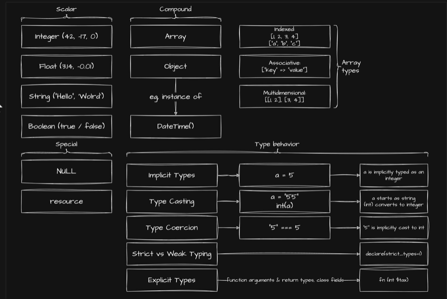

# Course PHP 8 (Luis Ramirez Jr)

---

## `Lecture 1` - Working with Data

[⬆️ Back to top](#course-php-8-luis-ramirez-jr)

- [`01` - Echo keyword](#01---echo-keyword)
- [`02` - Variables & Data type](#02---variables--data-type)

### `01` - Echo keyword

- **Echo** keyword: used to output value to screen, The value can be string, number, array, object,...
- **Echo** can use many time in the statement.
- The output values will be serialized (`sẽ được nối tiếp nhau`).
- Used the function handle before output value.

```php
<?php
    // 📌 single value
    $name = "Huynh Truong";

    echo "Hello world"; // Hello world
    echo $name; // Huynh Truong

    // 📌 multi value
    $name = "Huynh Truong";
    $age = 24;

    echo $name, " ", $age, " years old"; // Huynh Truong 24 years old

    // 📌 using operator (`toán tử`)
    $number_1 = 10;
    $number_2 = 20;

    echo $number_1 + $number_2; // 30

    // 📌 using variables in string
    $greeting = "Hello";
    $name = "Huynh Truong";

    echo "$greeting, $name"; // Hello, Huynh Truong

    // 📌 using with HTML
    echo "<h1>Hello world</h1>" // format text by h1 tag: Hello world
?>
```

[⬆️ Back to top](#lecture-1---working-with-data)

---

### `02` - Variables & Data type

1. **`Variables`**

- **Name rules**:
  - Contain `characters, numbers, underscores,...`
  - **MAY NOT** contain special (`#, %, &, @,...`)
  - The first letter start a letter or underscore. **But** number not allowed.

- **Important rules**:
  - Be descriptive (`mang tính mô tả`)
```php
<?php
    // GOOD
    $total_cart = 10;

    // BAD
    $tc = 10;
?>
```
  - Using meaningful abbreviations (`Các từ viết tắt có ý nghĩa`)
```php
<?php
    // GOOD
    $total_cart = 10;

    // BAD
    $totalc = 10;
?>
```
  - Avoid using single letters (`Tránh sử dụng một từ`)
```php
<?php
    // GOOD
    $total_cart = 10;

    // BAD
    $t = 10;
?>
```
  - Be consistent (`Mang tính nhất quán`)
```php
<?php
    // GOOD
    $name = "Huynh Truong";
    $age = 10;

    // BAD
    $NAME = "Huynh Truong";
    $AGE = 10;
?>
```
  - Avoid using generic data (`Tránh sử dụng từ chung chung`)
```php
<?php
    // GOOD
    $user_data = "Huynh Truong";

    // BAD
    $data = "Huynh Truong";
?>
```

- **Formatting Variable**:
  - **Camel Case**
```php
<?php
    $userData = "Huynh Truong";
?>
```
  - **Pascal Case**
```php
<?php
    $UserData = "Huynh Truong";
?>
```
  - **Snake Case**
```php
<?php
    $user_data = "Huynh Truong";
?>
```

2. **Data type**



- **Data types** have `2` type:
  - **Statically Typed**: Developer must explicit set the type of a variables. The type may never change after declaration.
  - **Dynamically Typed**: Don't need to set type for variable. The type may change at any time.

- **Data types** sẽ phân loại gồm:
  - **Scalar (`Kiểu data type đơn giản`)**: `integer`, `float`, `string`, `boolean`.
  - **Special (`Kiểu đặc biệt`)**: `null`, `resource`.
  - **Compound (`Kiểu data type phức tạp`)**: `array`, `object`. Trong `array type` sẽ có thêm (`indexed: dạng bình thường của array`, `associative: dạng key => value`, `multidimensional: dạng array lồng array con`)

- **Data types** sẽ có kiểu `implicit type` vs `explicit type`:
  - `Implicit type (Ép kiểu ngầm)`: Tức là PHP sẽ auto ép kiểu data type của variable đó.
```php
<?php

// 📌 Case 1: Ép kiểu number thành string khi dùng nối chuỗi (., +)
$result = 'This is ' . 10; // This is 10 (string)

// 📌 Case 2: Ép kiểu thành bool khi dùng trong if...else
$value = 10;
if ($value) { // value thành bool trong khi check if
  echo 'This is ' . $value;
} else {
  echo 'It is failed';
}

// 📌 Case 3: Ép kiểu khi dùng so sánh ==, ===
if (10 == '10') { // chúng sẽ được convert về number khi so sánh ==, còn === thì so sánh bằng data type
  echo 'It is equal'; // ✅
} else {
  echo 'It is not equal';
}
```
  - `Explicit type (Ép kiểu tường minh)`: Tức là **chủ động** ép kiểu của 1 variables nào đó.
```php
<?php

$value = 10;
$value = (string)$value; // chuyển $value từ number ---> string
```

3. **`var_dump` function**

- **var_dump**: Dùng để `view data type` của 1 variable.

```php
<?php
    $numb = 10;
    $name = "Huynh Truong";
    $null_value = null;
    $bool_value = true;
    $list_numb = [1, 2, 3, 4];

    echo var_dump($numb); // int(10)
    echo var_dump($name); // string(12) "Huynh Truong"
    echo var_dump($null_value); // NULL
    echo var_dump($bool_value); // bool(true)
    echo var_dump($list_numb); // array(4) { [0]=> int(1) [1]=> int(2) [2]=> int(3) [3]=> int(4) }
?>
```

> **⚠️Note**: Nếu bạn dùng function để check type trả về thì `function đó phải return 1 giá trị gì đó`. `Tránh return void`

4. **`Null` data type**

- If don't declaration a variable, **PHP** will return **undefined** as **Null**.

- **Recommend** use `lowercase` to write **Null** variable.

```php
<?php
    echo var_dump($data); // Undefined variable $data in C:\my-store\php\course-php\index.php on line 43
// NULL

?>
```

5. **`Bool` data type**

```php
<?php
  $isStudent = false;

  echo var_dump($isStudent); // bool
?>
```

6. **`Integer & Float` data type**

```php
<?php
  $average_numb = 10.5;

  echo var_dump($average_numb); // float(10.5)
?>
```

7. **`String` data type**

```php
<?php

  $data = "John";
  $last_name = "{$data} Smith";

  echo var_dump($last_name); // string(10) "John Smith"
  echo $last_name[3]; // n
?>
```

8. **`Array` data type**

```php
<?php

  $list_foods = ['Banana', 'Orange', 'Cucumber'];

  $list_foods[] = 'Apple'; // 📌 add an item
  $list_foods[1] = 'Lemon'; // 📌 replace item 1 in array

  echo var_dump($list_foods); // array(4) { [0]=> string(6) "Banana" [1]=> string(5) "Lemon" [2]=> string(8) "Cucumber" [3]=> string(5) "Apple" }

  echo $list_foods[5]; // 📌 Undefined array key 5
?>
```

9. **`Associative Array` (Mảng kết hợp)**

```php
<?php

  $list_foods = ['jane' => 'Banana', 'john' => 'Orange', 'mike' => 'Cucumber'];

  $list_foods[] = 'Apple'; // 📌 add an item, 📌 if don't set name for the item, PHP automatically set number to it 
  // 📌 but can set name when add an item
  $list_foods['victoria'] = 'Strawberry';
  $list_foods['john'] = 'Lemon'; // 📌 replace item 'john' in array

  echo var_dump($list_foods); // array(5) { ["jane"]=> string(6) "Banana" ["john"]=> string(5) "Lemon" ["mike"]=> string(8) "Cucumber" [0]=> string(5) "Apple" ["victoria"]=> string(10) "Strawberry" }
?>
```

10. **`Multidimesional Array`**

- It means nested array, array within array.

```php
<?php

  $list_foods = [
    'john' => ['Banana', 'Cucumber', 'Apple'],
    'mike' => 'Orange',
  ]

  echo $list_foods['john'][0]; // Banana
  echo $list_foods['bob']; // NULL
?>
```

11. **`Type Casting` (ép kiểu)**

```php
<?php

  $someNumber = 0;
  $emptyArray = [];

  // 📌 bool
  echo var_dump((bool) $someNumber); // bool(false)
  echo var_dump((bool) $emptyArray); // bool(false)
  echo var_dump((bool) 1); // bool(true)
  echo var_dump((bool) "0"); // bool(true)

  // 📌 int, float
  echo var_dump((int) 1); // int(1)
  echo var_dump((int) []); // int(0)
  echo var_dump((int) "0"); // int(0), casting string '0' to 0
  echo var_dump((int) null) // int(0)

  // 📌 string
  echo var_dump((string) null); // ''
  echo var_dump((string) false); // ''
  echo var_dump((string) true); // '1'
  echo var_dump((string) 0); // '0'
  echo var_dump((string) []); // 'Array'
  echo var_dump((string) ['John']); // 'Array'

  // 📌 array
  echo var_dump((array) false); // [false]
  echo var_dump((array) true); // [true]
  echo var_dump((array) 0); // [0]
  echo var_dump((array) 123); // [123]
  echo var_dump((array) 'John'); // ['John']
  echo var_dump((array) null); // []
?>
```

- Sometimes, you have a case from casting `array` to `string`, it will warning. (**Error Control Operator**)

```php
<?php

  $empty_array = [];
  echo var_dump($empty_array); // Warning: Array to string conversion in C:\my-store\php\course-php\index.php on line 63
// string(5) "Array"

  // 📌 can use `@` to PHP warning about this
  echo @var_dump($empty_array); // string(5) "Array"

?>
```

12. **`Operator Precedence`**

> [https://www.php.net/manual/en/language.operators.precedence.php](https://www.php.net/manual/en/language.operators.precedence.php)

- Operator Precedence between `&&` and `and`.
  - **&&**: higher precedence than `assignment`.
  - **and**: low precedence than `assignment`.

```php
<?php

  $isLogged = false && true;
  $isChecked = true and false;

  echo var_dump($isLogged); // bool(false)
  echo var_dump($isChecked); // bool(true), 📌 because it has low precedence than `assignment`

?>
```

13. **`Constant`**

- You can't assign other value.

```php
<?php
  const fullName = "John Smith";
  fullName = "Mike"; // 📌 PHP warnings error syntax
  echo fullName;
?>
```

[⬆️ Back to top](#lecture-1---working-with-data)

---

## `Lecture 2` - Syntax about logic (loop, if...else, switch, match,...)

### `01` - Match Expression

- **Match**: is a syntax to perform conditional checks base on value comparison. It is like **switch**, but it is very shorthand.
- It lives in **PHP v8**

```php
<?php
  $isNumberSafe = 1;
  $resultSafe = match($isNumberSafe) {
    1 => "Safed",
    2 => "No safe",
    default => "Unknown"
  }

  echo $resultSafe; // Safed
?>
```

- 📌 If don't have `default`, **PHP** throws error when no return default value.

---

### `02` - Function

```php
// 📌 Declare function with Parameters
function addNumber($number_1, $number_2) {
  return $number_1 + $number_2;
}

// 📌 Add union type
function greeting(string $message, string $name):string {
  return "{$message}, {$name}";
}

// Add mixed type (as any), default value, optional type return
function sayHello(string $message = "Hello", string $name) :?string {
  if(!$name) return
  return "{$message}, {$name}"
}

function subtractNumber(mixed $num_1, mixed num_2) {
  return num_1 + num_2;
}
```

---

### `03` - Loop (for)

```php
//  print number from 1 - 100
<?php
  for($i = 0; $i <= 99; $i++) {
    echo "Number:" . $i + 1;
  }
?>
```

---

### `04` - Loop (foreach)

```php
<?php
  $listFoods = ['Orange', 'Banana', 'Cucumber', 'Strawberry', 'Potato'];

  foreach($listFoods as $food) {
    var_dump($food);
  }

  // 📌 how show key index
  foreach($listFoods as $key => $food) {
    echo $key . $food;
  }

?>
```

---

## `Lecture 3` - Filling in the Gaps

### About `Const`

### `Unset` Variables

- **unset()**: destroys the specified variables.

```php
<?php
  $foo = 'bar';
  unset($foo);

  echo $foo; // ❌❌ foo is not defined.
?>
```

- **⚠️ Important Note**:

  - Nếu như bạn **unset()** bên trong function, nó chỉ affect tới local function thôi, chứ không affect global variable trừ khi bạn **unset()** nó ở global variable.

```php
<?php
  $foo = 'bar';

  function removeFoo() {
    unset($foo);
  }

  removeFoo();

  echo $foo; // ✅✅ bar
?>
```

### `Rounding` Number

- `floor, round, ceil`

```php
floor(2.4); // 2

round(2.4); // 2
round(2.45); // 2
round(2.5); // 3

ceil(2.4); // 3
```

- **round**: `round(float $num, int $precision = 0, int $mode = PHP_ROUND_HALF_UP): float`
- **floor**: `floor(float $num)`
- **ceil**: `ceil(float $num)`

### `Avoid` using `Function in Conditions`

---

### Including PHP `Files`

---
