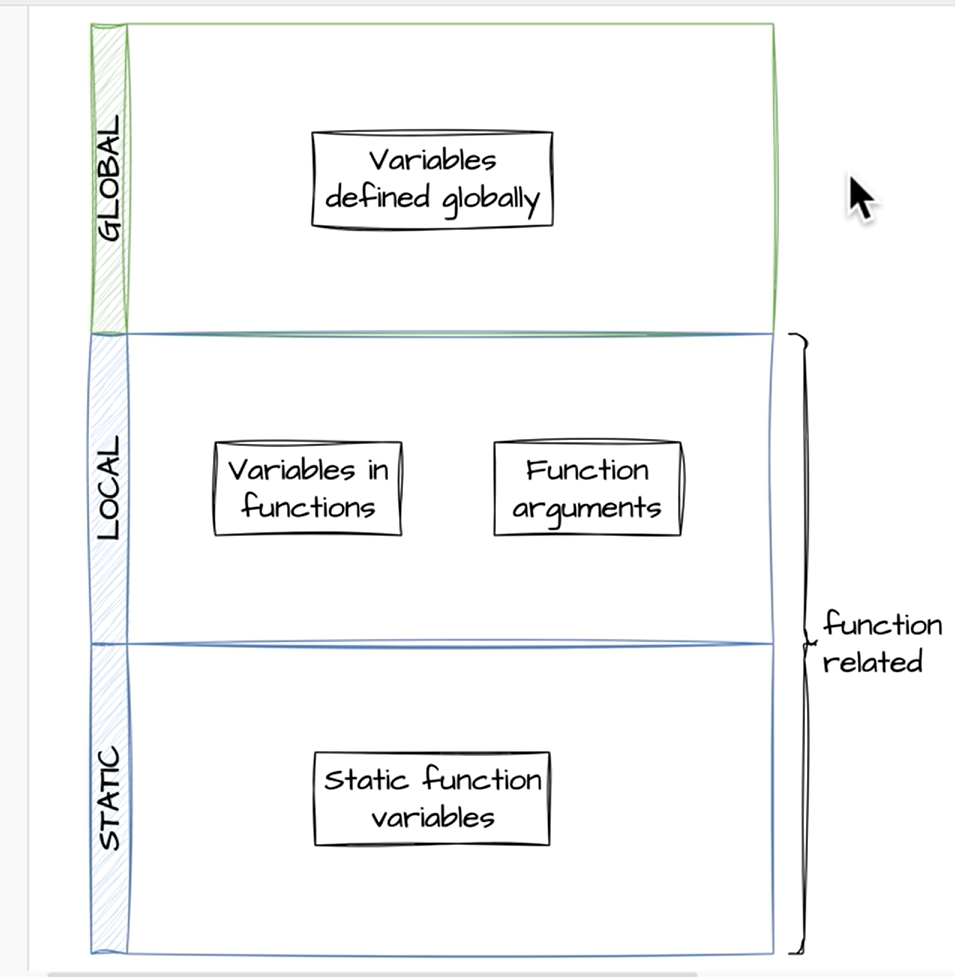

### Variable Scope



1. `Global Scope`

- Là 1 biến global có thể truy cập được nó (`Ngoại trừ function`).

```php
<?php
    $sayHello = 'Hello world';

    function getMessage() {
        echo "$sayHello"; // ❌ can't access this variable, because it is function scope
    }
?>
```

- Để function có thể truy cập biến global, bạn có thể dùng key `global` hoặc dùng key `$GLOBALS['variable']` trong function.

```php
<?php
    $sayHello = 'Hello world';

    function getMessage() {
        global $sayHello;
        echo "$sayHello"; // ✅ can access this variable

        // or
        $GLOBALS['sayHello'];
    }
?>
```

- **⚠️Note**: Khuyến khích **KHÔNG NÊN** sử dụng `global trong function`, vì nó `khó theo dõi`, `khó debug`, `khó bảo trì`.

2. `Local Scope`

- Là variable được khai báo trong `function `hoặc `method trong class`. Các variable trong function hoặc method `không thể truy cập từ bên ngoài được`.

```php
<?php
    function getMessage() {
        $message;
        echo "$message";
    }

    echo $message; // ❌ can't not access from outside of function: Undefined variable: message
?>
```

3. `Static Scope`

- Là sử dụng các variable `trong function` hoặc `trong method` sẽ giúp `giữ nguyên` value của variable đó được bảo toàn `giữa các lần gọi function hoặc method`.

```php
<?php
    function countNumber() {
        static $count = 1;
        echo "Count: $count\n";
        $count++;
    }

    echo countNumber(); // Count: 1
    echo countNumber(); // Count: 2
    echo countNumber(); // Count: 3
?>
```